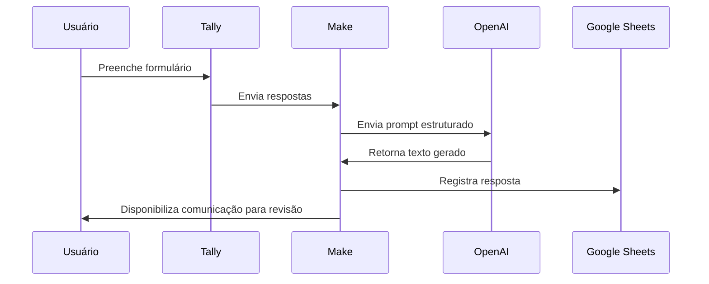

# Arquitetura da Solução

## Componentes

1. **Tally**
   - Coleta as informações necessárias para gerar a comunicação.
   - Funciona como interface inicial do usuário.

2. **Make**
   - Recebe os dados do formulário.
   - Organiza as variáveis.
   - Envia o prompt para o modelo de IA.
   - Registra o resultado final.

3. **OpenAI**
   - Processa o prompt.
   - Gera a comunicação corporativa com base nas regras definidas.

4. **Google Sheets**
   - Armazena entradas e saídas.
   - Permite histórico de uso e conferência dos resultados.

## Diagrama

